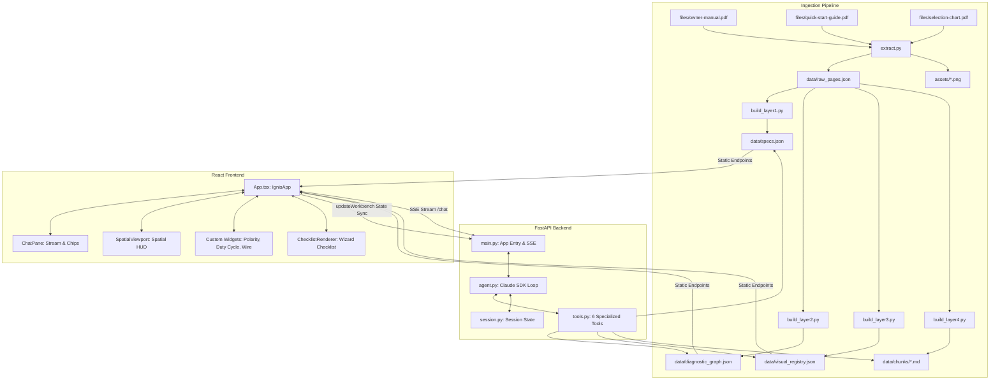

# Project Ignis: Multimodal AI Workbench for the Vulcan OmniPro 220

This document provides a comprehensive, deep-dive technical write-up detailing the architecture, codebase, ingestion pipeline, data structures, backend logic, frontend mechanics, and evaluation harness of **Project Ignis**. It is designed to act as an authoritative reference for engineers and Large Language Models (LLMs) to understand exactly how the project was built, its internal state flow, design decisions, and testing frameworks.

---

## 1. System Architecture Overview

Ignis is not a simple chatbot; it is a **multimodal reasoning workbench** designed to support technicians setting up or troubleshooting the Vulcan OmniPro 220 welder. 

The system is split into three main parts:
1. **Ingestion & Data Extraction Pipeline**: Pre-extracts and parses the 48-page Owner's Manual, Quick Start Guide, and Selection Chart into a structured 4-layer knowledge schema.
2. **FastAPI Backend (`backend/`)**: Serves data schemas, handles session state, and implements the Anthropic Claude Agent SDK tool-use loop with streaming SSE (Server-Sent Events) and prompt caching.
3. **React + TS + Vite Frontend (`frontend-v1/`)**: Implements an interactive workspace featuring a Spatial HUD (interactive coordinate mapping), custom math-based widgets, wizard-mode step-by-step checklists, and bi-directional state-syncing with the backend.



---

## 2. Ingestion & Structured Knowledge Layers

To prevent hallucinations on safety-critical settings, Ignis does not feed raw PDF pages directly to the model on every query. Instead, it extracts the manual's tables, diagrams, and procedures once during ingestion.

### Phase 1: PDF Extraction (`ingestion/extract.py`)
1. **Image Rendering**: Uses `PyMuPDF` (`fitz`) to render all PDF pages to high-resolution PNGs at 200 DPI under the `assets/` directory.
2. **Text Extraction**: Uses `pymupdf4llm` to convert PDF pages to clean Markdown chunks, preserving tables and bulleted layouts.
3. **Claude Vision Pass**: Evaluates 13 specific pages of the manual (containing wiring schematics, duty cycle matrices, weld diagnosis photos, and labeled controls) through a vision inspection prompt via `claude-sonnet-4-20250514`. This pass extracts exhaustive textual descriptions of visual content, which are compiled alongside the markdown text into `data/raw_pages.json`.

### Building the 4-Layer Schema

*   **Layer 1: Hard Specifications (`ingestion/build_layer1.py` → `data/specs.json`)**
    Contains nameplate limits, voltage/amperage mappings, polarity rules, wire sizes, shielding gas flow rates, and circuit breaker constraints from ground-truth tables in the manual. This acts as the source-of-truth reference to block hallucinations on safety-critical settings.
*   **Layer 2: Diagnostic Trees (`ingestion/build_layer2.py` → `data/diagnostic_graph.json`)**
    Converts manual troubleshooting matrices into a structured JSON state machine containing question nodes (e.g. *"Is gas flow set to 20-30 SCFH?"*) and terminal nodes containing fixes (e.g. *"Fix: Open gas cylinder valve"*).
*   **Layer 3: Visual Registry (`ingestion/build_layer3.py` → `data/visual_registry.json`)**
    Registers all rendered diagram and photo assets with page numbers, description strings, and semantic tags, allowing the agent to fetch precise visual references by name or semantic query.
*   **Layer 4: Procedural Guides (`ingestion/build_layer4.py` → `data/chunks/*.md`)**
    Splits the manual into structured markdown procedural files (e.g. `wire_spool_install.md`, `tig_torch_assembly.md`) to serve as knowledge context during tool lookups.

---

## 3. Backend Architecture (`backend/`)

The backend is built with FastAPI and runs the tool-calling loop using the Anthropic Claude SDK.

### Endpoint Structure (`backend/main.py`)
*   `POST /chat`: SSE streaming endpoint. Receives a list of messages and a `session_id`. Runs the agent loop and streams JSON events representing text deltas, tool calls, and completion indicators.
*   `GET /specs` & `GET /baseline-grid`: Serve structured machine parameters directly to the frontend widgets.
*   `GET /assets/{path}`: Serves static manual page PNGs and diagrams to the UI.

### Agent Loop & Tool Routing (`backend/agent.py`)
The agent loop is coordinate by `run_agent()`, which implements several key patterns:
1.  **Iterative Tool Loop**: Initiates a multi-turn message stream with `claude-sonnet-4-20250514`, permitting up to 5 consecutive tool calls per user turn to resolve dependencies before responding.
2.  **Canned Response Cache (`cached_responses.json`)**: Speeds up repeated single-turn queries by storing exact normalized string match results, bypassing API hits for static lookups.
3.  **Dynamic System Prompt Construction**: The system prompt is constructed dynamically on each request by combining:
    *   *Static Rules*: Hard boundary instructions (e.g., response length limits, widget constraints, formatting).
    *   *Manual Context*: Concatenated markdown files from `data/chunks/`.
    *   *Session Context*: Active workspace variables (e.g., selected welding process, input voltage, sheet thickness) synchronized from the frontend.

#### Ephemeral Prompt Caching
To maintain sub-second response times and control token costs, Ignis utilizes Anthropic's **ephemeral prompt caching** (`prompt-caching-2024-07-31` beta headers):
*   The large static rules and manual context block (~10k tokens) is flagged as cacheable using `"cache_control": {"type": "ephemeral"}`.
*   Consecutive turns in multi-turn troubleshooting sessions hit the cache, lowering input token processing costs by up to **90%** and reducing user latency from ~4.5s down to sub-second responses.

### Tool Definitions (`backend/tools.py`)
The agent has access to 6 specialized tools mapping to the knowledge layers:
1.  `get_machine_spec`: Fetches records from `specs.json` (duty cycles, polarity rules, breaker details, drive roll tension).
2.  `diagnose_defect`: Traverses the state-machine trees inside `diagnostic_graph.json` node-by-node based on the current state and yes/no user responses.
3.  `get_visual`: Queries `visual_registry.json` by exact ID or semantic search to return image assets.
4.  `search_manual`: Performs keyword searches over markdown chunks. Prioritizes chunks matching the active session's welding process (e.g. MIG setups boost spool install and wire feed relevance score).
5.  `get_fault_code`: Resolves LCD warnings (e.g. *"Low Voltage Input"*) to descriptions and corrective actions in `fault_codes.json`.
6.  `get_synergic_settings`: Performs mathematical parsing of sheet thickness (fractional or gauge) to match or interpolate the correct voltage and WFS configuration in `baseline_grid.json`.

---

## 4. Frontend Architecture & Mechanics (`frontend-v1/`)

The frontend is a single-page React app designed for use in a workshop environment. It is split into a **conversational pane** (left) and an **interactive workbench** (right).

```
+-------------------------------------------------------------------+
|                           Header HUD                              |
|   Turns: 3  |  Cost: $0.012  |  Input Volts: 240V  |  Proc: MIG   |
+------------------------------------+------------------------------+
|                                    |                              |
|                                    |         Spatial HUD          |
|                                    |     (Viewer/Highlights)      |
|             Chat Pane              |                              |
|                                    +------------------------------+
|     * Streaming text bubbles       |                              |
|     * Inline tool chips            |        Custom Widgets        |
|     * Micro-animations             |  (Duty Cycle, Polarity SVG)  |
|                                    |                              |
+------------------------------------+------------------------------+
```

### Spatial HUD (`SpatialViewport/index.tsx`)
The welder HUD displays three layout diagrams: **Front**, **Interior** (side door open), and **Back**. 
*   **Coordinate Overlays (`registryData.ts`)**: Components (such as dials, sockets, spool hubs, and fans) are mapped to 2D pixel coordinates and radii.
*   **Interactive Highlights**: The backend can emit a `<spatial view="front" highlights="positive_socket,negative_socket" />` tag at the start of its response. The HUD switches to the appropriate view and renders pulsing highlighting rings over the coordinates.
*   **Animated Circuits**: Setting `draw_path="true"` triggers an animated connection line (e.g. tracing from the MIG gun cable socket to the negative terminal) to physically guide cable plug placement.

### Custom Widgets (`widgets/`)
The workbench renders specialized React widgets to replace wordy text descriptions:
1.  **`DutyCycleWidget`**: Mathematically computes and renders the duty cycle limit based on process, voltage, and input amperage, showing cooling countdown indicators.
2.  **`WireSettingsWidget`**: Displays appropriate drive roll tension settings (solid wire: 3–5, flux-cored: 2–3), wire diameter checks, and contact tip to work distance (CTWD).
3.  **`PolarityConfigurator` (`CableDiagram`)**: Renders an interactive SVG of the front panel sockets, showing DCEP vs DCEN cable paths.

### Anti-Hallucination Boundaries
To prevent the LLM from fabricating numbers inside these widgets, the system enforces a strict boundary:
*   The agent does not generate the numbers inside the widget. Instead, it emits a parameter block:
    ```html
    <artifact id="mig-polarity" type="widget" name="PolarityDiagram">
      {"process": "MIG"}
    </artifact>
    ```
*   The React frontend receives this XML block, parses the JSON input, and extracts the correct parameters directly from `specs.json` or `baseline_grid.json`. The LLM's role is restricted to **intent routing**, making it impossible for it to hallucinate values on screen.

### Bi-Directional State Syncing
*   When a user interacts with widgets (e.g., adjusting the thickness knob or changing process from MIG to flux-cored), the frontend calls `updateWorkbench(payload)`.
*   This payload updates the backend's session state.
*   The next time a chat request is submitted, these variables are injected into the agent's system prompt:
    ```json
    {
      "process": "MIG",
      "voltage": "240V",
      "thickness": "1/8\"",
      "wire_size": "0.030\""
    }
    ```
*   This keeps the model aware of the physical workstation configuration without prompting the user.

---

## 5. Evaluation Harness & Golden Dataset

To ensure accuracy, the project includes a customized validation suite (`eval.py`).

### Golden Dataset (`eval/golden_dataset.json`)
Consists of 53 ground-truth questions grouped into 9 categories:
*   `spec`: Exact specification lookups.
*   `diagnostic`: Multi-turn troubleshooting trees.
*   `polarity_setup`: Ground clamp and terminal connections.
*   `fault_code`: LCD warnings.
*   `technique`: Welding angles, spool tensioning, etc.
*   `synergic`: Material thickness settings.
*   `adversarial`: Out-of-bounds questions or boundary testing.
*   `no_info`: General unanswerable scenarios.
*   `complex`: Queries requiring multi-step tool reasoning.

### Scoring Rubric (/7 Points)
Every test case is run through the agent, and its full response is graded by an LLM Judge (`claude-sonnet-4-20250514` running a strict evaluation prompt) or exact match rules:
1.  **Technical Accuracy (0–3)**: Correctness of facts. Any hallucinated number or guessing a diagnostic fix without tracing the graph caps this at 1.
2.  **Tool Routing (0–2)**: Correctness of tool execution. Deducts points if tools are missing, out-of-order, or if the agent asks redundant questions already answered by the user.
3.  **Multimodal Output (0–2)**: Penalizes failure to render required diagrams, widgets, or checklists.
4.  **Citations (true/false)**: Validates if the page source is accurately referenced.
5.  **Tone (0–1)**: Verifies the response is direct, concise, and lacks verbose safety disclaimers.

### Variance Auditing
The harness supports running multiple iterations (e.g. `python eval.py --runs 3`) to calculate the standard deviation of scores across runs. This is specifically used to find non-deterministic loops in diagnostic trees.

---

## 6. Generalization & Scaling Strategy

While Ignis was built specifically for the Vulcan OmniPro 220, its architecture generalizes to other machines through its structured knowledge schema:

1.  **Schema Synthesis**: New equipment manuals are processed through the `extract.py` pipeline to yield `specs.json` (Layer 1) and `diagnostic_graph.json` (Layer 2).
2.  **Visual Alignment**: Bounding boxes for new machine panel drawings are registered into `visual_registry.json` (Layer 3).
3.  **HIL Verification**: The outputs are evaluated against the structured check prompts inside `eval/audit_ingestion_prompt.md` to catch extraction defects before deploying the updated agent.
