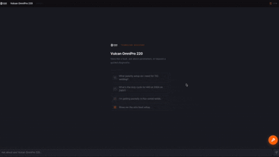
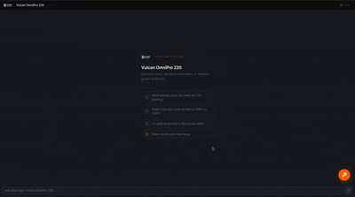
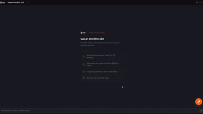
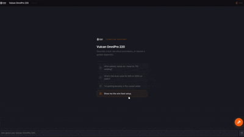
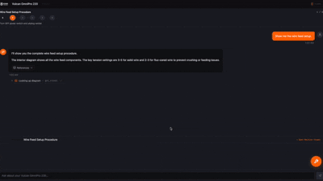

# Ignis — Multimodal AI Workbench for the Vulcan OmniPro 220

[Watch the walkthrough →](https://vimeo.com/1195215908)

> 📖 **Deep Dive:** For a complete architectural breakdown, data structures, and evaluation rubric details, see the [Technical Write-up](Project-details.md).

---

## Quick Start

```bash
git clone https://github.com/jerusan/Ignis.git
cd ignis
cp .env.example .env  # Add ANTHROPIC_API_KEY
docker compose up
```

Open http://localhost:8080

**Or manually:**

```bash
# Backend
python3 -m venv .venv && source .venv/bin/activate
pip install -r requirements.txt
uvicorn backend.main:app --reload

# Frontend (new terminal)
cd frontend-v1
npm install && npm run dev
```

Open http://localhost:5173

---

## Why Not a Chatbot

Nobody reads a 48-page manual. But a multiprocess welder with duty cycle matrices, per-process polarity configs, wire feed tensioner specs, and weld diagnosis photos needs expert-level support — not paragraphs of text.

Before writing any code, I scraped public welding forums using Grok and categorized the results with an LLM. The goal was to understand what technicians actually ask — not infer it from the manual. The pattern was consistent: speed numbers, wiring logic, and physical component placement.

**Intentionally unscalable, by design.** Ignis follows a product-first ingestion strategy: build the extraction and response layers specifically for this machine, manually verify the generated JSON and markdown files for the first product, and generalize the pattern once it's proven. Welding machines vary enough in structure — duty cycle tables, process configs, wiring diagrams — that forcing a common schema across products now would produce a schema that fits none of them well. The plan is to do this properly for the first N products, let the natural shape of the data surface a common structure, and generalize from evidence rather than assumption. A horizontally-scaled RAG dump over 48 pages would be easier to build and worse to use.

---

## Knowledge Architecture

The PDF is pre-extracted into structured JSON and markdown rather than queried raw on each request. Feeding raw PDF pages to the model for every question introduces high hallucination rates on dense tabular data — voltage tables, wire speed charts, duty cycle matrices. Structuring it once upfront lets the agent retrieve exact values instead of re-interpreting page layout at query time.

| Layer | File | Purpose |
|---|---|---|
| Hard specs | `specs.json` | Numeric tables — duty cycles, current ranges, schema-constrained to block hallucinations on safety-critical values |
| Decision trees | `diagnostic_graph.json` | Troubleshooting matrices converted to a traversable yes/no graph |
| Visual registry | `visual_registry.json` + `frontend-v1/src/components/SpatialViewport/registryData.ts` | Named visual queries resolved by the backend; pixel coordinates for each part defined in the frontend |
| Procedural guides | `chunks/*.md` | Step-by-step guides parsed via PyMuPDF + Claude, retaining strict tabular data integrity |

At runtime, `search_manual` applies a process-aware boost when ranking chunks: if the session state shows the user is on MIG, wire feed and spool install chunks rank higher automatically — no manual section routing required.

### Ingestion Pipeline

Three source PDFs feed the pipeline: the 48-page `owner-manual.pdf`, `quick-start-guide.pdf`, and `selection-chart.pdf`. All four knowledge layers are generated by a reproducible pipeline — run from repo root with the venv active:

```bash
bash run_ingestion.sh
```

The five-stage pipeline extracts text, exports page PNGs, then runs one build script per layer. Extraction includes a selective Claude vision pass on 13 owner-manual pages — those containing polarity schematics, duty cycle matrices, weld diagnosis photos, and labeled component diagrams — where critical information exists only in image form. Text-only pages skip the vision pass entirely.

After ingestion, all extracted files are verified against the source PDF to catch conversion errors before they reach the agent.

**Source data validation pipeline:**

```
Ingestion layer output (JSON + Markdown)
          ↓
Gemini 3.1 Pro — flags potential hallucinations
          ↓
Claude Opus 4.7 — refines and corrects extracted data
          ↓
Gemini 3.1 Pro — second-pass verification
          ↓
Random manual sampling
```

For a production system with only 48 pages, full human verification is the right call. For this demo, the multi-model pipeline gets close enough to trust the output on spec numbers.

### Production Optimizations: Ephemeral Prompt Caching

To ensure sub-second response times and control API costs, Ignis leverages Anthropic's **ephemeral prompt caching** (`prompt-caching-2024-07-31`). 

* **The Ingestion Context:** The entire structured manual context (~10,000 tokens) is marked as cacheable.
* **The Impact:** For multi-turn diagnostic sessions, consecutive turns hit the cache, reducing input token processing costs by up to **90%** and reducing user latency from ~4.5s down to sub-second responses.

---

## UI

### Custom Widgets

Prose descriptions of hardware configuration are useless to someone wearing welding gloves. The agent routes intent to interactive components instead of generating text:

- **Duty Cycle Calculator** — hard math evaluation, not estimation


- **Specifications Configurator** — process + material + thickness → wire speed + voltage


- **Polarity Diagram** — cable-to-socket visual showing exactly which plug goes where


The Claude Agent SDK loop acts purely as a deterministic intent router and conversational coordinator — leveraging strict tool-calling schemas to trigger custom components instead of interpreting parameters on the fly.

#### Anti-Hallucination Boundaries
To prevent the LLM from fabricating numbers inside these widgets, the system enforces a strict boundary:
*   The agent does not generate the numbers inside the widget. Instead, it emits a parameter block:
    ```html
    <artifact id="mig-polarity" type="widget" name="PolarityDiagram">
      {"process": "MIG"}
    </artifact>
    ```
*   The React frontend receives this XML block, parses the JSON input, and extracts the correct parameters directly from `specs.json` or `baseline_grid.json`. The LLM's role is restricted to **intent routing**, making it physically impossible for it to hallucinate values on screen.

### Manual Reference

Every answer surfaces its source. The manual page used to generate the response is returned alongside the answer as an expandable reference image toggle — users can verify the exact passage or diagram without leaving the chat.

### Spatial HUD

Pixel-coordinate overlays across Front, Back, and Open-Side cabinet layouts. When a procedure is discussed, the relevant component is pinned on the machine visual.

**Bi-directional state syncing:** As the technician interacts with custom widgets (e.g., changing wire diameter or thickness), the frontend calls `updateWorkbench(payload)` to update the backend session state.
*   This payload updates the backend's session state.
*   The next time a chat request is submitted, these variables are injected into the agent's system prompt:
    ```json
    {
      "process": "MIG",
      "voltage": "240V",
      "thickness": "1/8\"",
      "wire_size": "0.030\""
    }
    ```
*   This keeps the Claude agent dynamically aware of the physical machine configuration without the user typing it.


### Wizard Mode

Setup procedures trigger a checklist artifact. Each completed step advances the machine visual to highlight the next relevant component. Progress is tracked in a compact step bar above the chat.



[Watch a sample troubleshooting walkthrough →](https://vimeo.com/1195215907)

### Panel Auto-Focus

When the answer maps cleanly to polarity, duty cycle, or synergic parameters, the right pane auto-switches to the relevant panel and pre-fills it — no manual tab hunting.


---

## Design Trade-offs

### No Live Photo Diagnosis

In a safety-critical environment, a confident wrong answer is worse than no answer. Weld quality assessment via photo depends on lighting, camera angle, and distance — none of which are controlled in a shop. A VLM pattern-matching on an inconsistent input can confidently misidentify porosity as undercut or vice versa, sending a technician down the wrong fix path. Instead, Ignis routes users through the deterministic diagnostic graph, forcing observation of specific symptoms with yes/no decisions. Where visual comparison helps, canonical reference photos from the manual are surfaced so the technician makes the call themselves — not the model.

### No Voice Input

Making STT reliable in a welding shop is a separate engineering problem: sustained background noise requires audio gating, and domain-specific terms (DCEP, FCAW, synergic, TIG, MIG) have high error rates in generic speech recognition without fine-tuning on welding vocabulary. Solving that properly would dwarf the core problem in scope. A touch-first UI with large hitboxes solves the gloves problem directly and works without any of that infrastructure.

---

## Eval

53 questions across 9 categories, scored /7: technical accuracy (0–3), tool routing (0–2), multimodal (0–2). Checks whether artifacts trigger on the right questions, citations are accurate, and responses are not verbose.

**Current benchmark — 89.3% passing (≥ 6/7) · avg 6.55 / 7 · 1.3 hallucinations/run**

| Category | Questions | Pass rate | Avg |
|---|--:|--:|--:|
| adversarial | 4 | 100% | 7.00 |
| fault_code | 3 | 100% | 7.00 |
| no_info | 3 | 100% | 7.00 |
| spec | 10 | 100% | 7.00 |
| synergic | 5 | 100% | 7.00 |
| technique | 6 | 100% | 6.83 |
| polarity_setup | 6 | 100% | 6.89 |
| complex | 4 | 92% | 6.67 |
| **diagnostic** | **12** | **56%** | **5.25** |

Spec, fault codes, synergic, and adversarial all score 100% — the categories where correctness is non-negotiable. Diagnostic is the known gap: the agent loses track of traversal state across multi-step user turns, producing non-deterministic loop paths where it skips low-level hardware checks (e.g., Eurofitting connections, relay click confirmation) that the graph requires before advancing. The hallucination rate of 1.3/run is concentrated here. Variance audits via `python eval_report.py --runs 3` are being used to isolate which graph nodes are consistently skipped, with fixes targeting those missing edges directly in `diagnostic_graph.json`.

### The Grading Rubric (/7 Points)

Every query is graded against ground-truth parameters by a Claude Sonnet judge using a strict rubric:
1. **Technical Accuracy (0–3):** Scored on whether all facts and key numbers match ground truth. Any hallucinated spec or guessing a troubleshooting fix without tracing the diagnostic graph caps the score at 1.
2. **Tool Routing (0–2):** Penalizes the agent for failing to call required specs or asking redundant questions already answered by the user.
3. **Multimodal Output (0–2):** Evaluates if the required diagrams, photo comparison charts, or custom interactive widgets were correctly surfaced.

*We also run variance audits (via `python eval_report.py --runs 3`) to calculate the score standard deviation across runs, allowing us to find and fix non-deterministic diagnostic loops.*

---

## Future Generalization Strategy

Ignis was intentionally built "unscalable" to prioritize zero-hallucination accuracy for the Vulcan OmniPro 220. To scale this system to $N$ machines, we use our structured **4-Layer Knowledge Schema**:

1. **Schema Generation:** Use the automated multi-model ingestion pipeline to parse new PDFs and output matching `specs.json` (Layer 1) and `diagnostic_graph.json` (Layer 2) files.
2. **Spatial Alignment:** Add named visual entries for new machine diagrams to `visual_registry.json` (Layer 3), and define the corresponding pixel coordinates for each part in `frontend-v1/src/components/SpatialViewport/registryData.ts`.
3. **Human-in-the-Loop Audit:** Audit the generated schemas using the structured audit prompts in `eval/` before committing to the agent knowledge base.

---

## API & Tool Reference

### Endpoints (`backend/main.py`)
| Endpoint | Method | Description |
|---|---|---|
| `/chat` | `POST` | SSE stream for agent turns (receives message history + `session_id`) |
| `/specs` | `GET` | Serves structured specifications table (`specs.json`) |
| `/baseline-grid` | `GET` | Serves synergic parameter grid (`baseline_grid.json`) |
| `/assets/{path}` | `GET` | Serves static manual page PNG assets to the UI |

### Agent Tools (`backend/tools.py`)
1.  **`get_machine_spec`** — Fetches numeric ranges, duty cycles, polarity configurations, and power ratings from `specs.json`.
2.  **`diagnose_defect`** — Walks node-by-node through the traversable yes/no state machine trees in `diagnostic_graph.json`.
3.  **`get_visual`** — Resolves coordinate overlays, cable setups, and reference diagrams by name or semantic query from `visual_registry.json`.
4.  **`search_manual`** — Performs keyword searches over procedural guide chunks, applying a relevance boost based on the active process.
5.  **`get_fault_code`** — Looks up LCD error messages in `fault_codes.json` to return exact definitions and corrective actions.
6.  **`get_synergic_settings`** — Computes wire feed speed and voltage configs for MIG/flux-cored based on material type, thickness, and wire diameter.

---

## Stack

| | |
|---|---|
| Agent | Anthropic Claude Agent SDK, Claude Sonnet |
| Backend | Python, FastAPI |
| Frontend | React, TypeScript, Vite, Tailwind CSS |
| Knowledge extraction | PyMuPDF, Claude, Grok |
| Eval | Custom two-stage harness — LLM judge + exact match |

---

📖 **Looking for more?** For a complete architectural breakdown, data structures, and evaluation rubric details, see the [Technical Write-up](Project-details.md).
